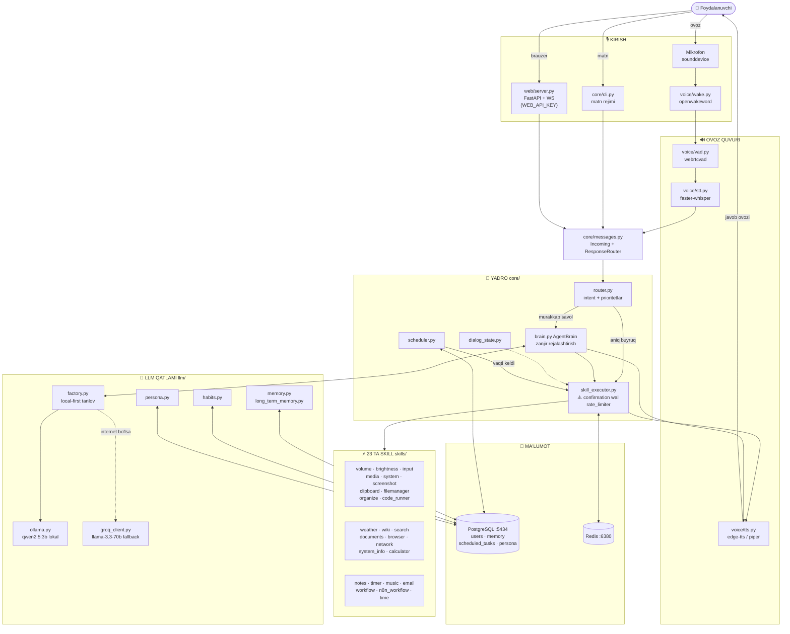

# 🏛️ ZARI — TO'LIQ ARXITEKTURA

> Jarvis-uslubidagi AI yordamchi. **Local-first**: standartda barchasi sizning kompyuterida ishlaydi.

---

## 1️⃣ Umumiy manzara — uch qavatli oqim

```
┌─────────────────────────────────────────────────────────────────────────────┐
│                            👤 FOYDALANUVCHI                                 │
└───────┬──────────────────┬───────────────────┬──────────────────────────────┘
        │ 🎙️ "Zari!"       │ ⌨️ matn           │ 🌐 WebSocket
        ▼                  ▼                   ▼
╔═══════════════════════════════════════════════════════════════════════════╗
║ 1-KAVAT: KIRISH (Input)                                                   ║
║                                                                           ║
║  voice/wake.py      voice/vad.py      voice/stt.py     core/cli.py        ║
║  ┌─────────────┐    ┌────────────┐    ┌─────────────┐   ┌─────────────┐   ║
║  │ openwake-   │───▶│ webrtcvad  │───▶│ faster-     │   │ Matn rejimi│   ║
║  │ word        │    │ gap aniqlash│   │ whisper     │   │ --text      │   ║
║  │ "Zari!" uyg'│    │ (gap boshi/ │   │ STT+UZ→EN   │   │ --test-mic  │   ║
║  │ otishi      │    │  oxiri)     │   │ tarjimon    │   │ diagnostika │   ║
║  └─────────────┘    └────────────┘    └──────┬──────┘   └──────┬──────┘   ║
║                                              │                 │          ║
║  web/server.py ──────────────────────────────┼─────────────────┘          ║
║  FastAPI + WS (WEB_API_KEY + token) ◀────────┘                            ║
╚══════════════════════════════════════════════╤════════════════════════════╝
                                               ▼
╔═══════════════════════════════════════════════════════════════════════════╗
║ 2-KAVAT: YADRO (core/)                                                    ║
║                                                                           ║
║   core/main.py  ZariPipeline — bosh orkestrator, background GC            ║
║        │                                                                  ║
║        ▼                                                                  ║
║   core/messages.py ┌────────────────────────────────────────┐             ║
║   Incoming(text,   │  ResponseRouter (correlation ID)       │             ║
║   source, cid) ───▶│  • queue race himoyasi                 │             ║
║                    │  • javob faqat to'g'ri so'rovchiga     │             ║
║                    └───────────────┬────────────────────────┘             ║
║                                    ▼                                      ║
║   core/router.py ┌──────────────────────────────────────────┐            ║
║                  │ INTENT_PATTERNS × PRIORITET              │            ║
║                  │                                          │            ║
║                  │  organize(82) filemanager(80) screenshot(80)           ║
║                  │  browser(75) volume(78) brightness(76) documents(70)   ║
║                  │  weather(70) timer(65) calc(60) notes(55) media(52)    ║
║                  │  music(50) code_runner(40) email(40) workflow(35)      ║
║                  │  time(30) system(25) sysinfo(22) search(20) wiki(15)   ║
║                  │  chat(0)                               │               ║
║                  └──────────┬──────────────┬──────────────┘               ║
║              aniq buyruq    │              │ murakkab savol               ║
║                             ▼              ▼                              ║
║   ┌──────────────────────────┐   ┌────────────────────────────────┐       ║
║   │ skill_executor.py        │   │ brain.py — AgentBrain          │       ║
║   │ ┌──────────────────────┐ │   │ ┌────────────────────────────┐ │       ║
║   │ │⚠️ CONFIRMATION WALL │ │   │ │ LLM zanjir rejalashtiradi: │ │       ║
║   │ │ xavfli → so'raydi    │ │◀──│ │ ["music","weather","notes"]│ │       ║
║   │ ├──────────────────────┤ │   │ │ har qadam natijasi keyingi-│ │       ║
║   │ │ rate_limiter         │ │   │ │ siga kontekst bo'ladi      │ │       ║
║   │ │ param sanitizatsiya  │ │   │ └────────────┬───────────────┘ │       ║
║   │ │ zanjir xavfida STOP  │ │   │ persona · esdalik · dialog_state│      ║
║   └───────────┬──────────────┘   └──────────────┴─────────────────┘       ║
║               │                          core/scheduler.py                ║
║               │                          vaqti kelgan vazifalarni          ║
║               │◄─────────────────────────qayta yuboradi (DB barqaror)─────║
╚═══════════════╧════════════════════════════════════════════════════════════╝
                ▼
```

## 2️⃣ Skill'lar xaritasi — 23 ta modul

`skills/loader.py` avtomatik kashf etadi (har fayl = 1 klass).

```
💻 KOMPYUTER BOSHQARUVI          📚 MA'LUMOT VA TAHLIL
├─ volume      amixer ±%         ├─ documents   PDF/DOCX/XLSX o'qish+yaratish
├─ brightness  xrandr ≥0.2       ├─ browser     Playwright: ochish/qidirish/
├─ input       xdotool ⚠️tasdiq  │              YouTube ijro (xdg-open)
├─ media       playerctl+mpv     ├─ weather     API ob-havo
├─ screenshot  mss+Pillow        ├─ wikipedia   izohli maqola
├─ clipboard   pyperclip         ├─ search      DuckDuckGo (+Perplexica opt.)
├─ filemanager ⚠️savatga o'chirir├─ network     IP/ping/portlar
├─ system      xdg-open/pkill ⚠️ ├─ system_info CPU/RAM/disk/uptime
├─ organize    ⚠️papka saralash  └─ calculator  matematik ifodalar
└─ code_runner ⚠️subprocess 30s

✅ AKSIYALAR VA HAYOT
├─ notes       eslatmalar (DB)    ├─ music       musiqa pleylisti
├─ timer       taymer/alarm (DB) ├─ time        soat/sana (o'zbekcha)
├─ email       Gmail SMTP        └─ workflow / n8n_workflow  avtomatlashtirish

⚠️ = requires_confirmation=True (foydalanuvchi tasdig'i MAJBURIY)
```

## 3️⃣ Aql qatlami — llm/

```
                      ┌──────────────────────────┐
                      │ llm/factory.py           │
                      │ create_llm_client()      │
                      └──────┬────────────┬──────┘
              LLM_PROVIDER=  │            │  LLM_PROVIDER=
              "ollama" ▼     │            │  ▼ "groq"
              ┌──────────────────┐   ┌──────────────────────┐
              │ llm/ollama.py    │   │ llm/groq_client.py   │
              │ LOCAL-FIRST ✓    │   │ fallback (bulut)     │
              │ qwen2.5:3b       │   │ llama-3.3-70b        │
              │ localhost:11434  │   │ GROQ_API_KEY kerak   │
              └──────────────────┘   └──────────────────────┘

Yordamchi miya modullari:
┌────────────────────┐ ┌──────────────────┐ ┌──────────────────────┐
│ translator.py      │ │ memory.py        │ │ persona.py           │
│ UZ↔EN ikki tomonlama│ │ qisqa sessiya    │ │ shaxsiyat DB'dan     │
│ (whisper uchun)    │ │ kontekst oynasi  │ │ (ism, uslub, til)    │
└────────────────────┘ └──────────────────┘ └──────────────────────┘
┌────────────────────┐ ┌──────────────────┐
│ long_term_memory.py│ │ habits.py        │
│ DB'da doimiy faktlar│ │ davriy odat      │
│ (pgvector M9 da)   │ │ tahlili (interval)│
└────────────────────┘ └──────────────────┘
```

## 4️⃣ Ma'lumot qatlami — db/ + alembic

```
┌─────────────────────────────────┐   ┌──────────────────────┐
│ PostgreSQL :5434 (asyncpg pool) │   │ Redis :6380          │
│ docker: zari-db                 │   │ docker: zari-redis   │
│                                 │   │ db/cache.py          │
│ alembic/versions/               │   │ sessiya + tez cache  │
│ ├─ 001_initial (idempotent)     │   └──────────────────────┘
│ └─ 002_scheduled_tasks          │
│                                 │
│ Jadvallar:                      │   Ishlatuvchilar:
│ ├─ users                        │   ├─ scheduler (vazifalar)
│ ├─ memory ←memory_repo.py      │   ├─ notes/timer skill'lari
│ ├─ scheduled_tasks              │   ├─ long_term_memory
│ └─ persona                      │   └─ habits analizi
└─────────────────────────────────┘

workflows/ → workflow_db + executor (n8n template bazasi)
agents/    → (M12 Multi-Agent uchun bo'sh joy)
data/      → runtime fayllar
```

## 5️⃣ Xavfsizlik devori — har bir buyruq o'tadigan yo'l

```
Buyruq keldi
    │
    ▼
┌─────────────────────────────────────────────────┐
│ 1. rate_limiter — suv toshirish himoyasi        │
│ 2. Router intent aniqlaydi                       │
│ 3. skill.requires_confirmation tekshiriladi     │
│    ├─ False → darhol bajarish                   │
│    └─ True  → dialog_state.begin_confirm()      │
│              "Ha/yuq?" javobi kutiladi          │
│ 4. Brain ZANJIRIDA ham PRE-SKAN:                │
│    reja to'liq shakllangach HAR QADAM           │
│    tekshiriladi; birinchi xavfli qadamda        │
│    BUTUN ZANJIR bekor → tasdiq so'raladi        │
│    (qolgan xavfsiz qadamlar ham bajarilmaydi)   │
└─────────────────────────────────────────────────┘

Kafolatlar:
• O'chirish HECH QACHON chetlab o'tmaydi → send2trash savat
• input skill: matn kiritish TAQIQ, kalit allowlist, koordinata limiti
• brightness MIN 0.2 (qora ekran himoyasi)
• code_runner: subprocess + timeout 30s + tasdiq majburiy
• .env.docker gitga kirmaydi; WS token + WEB_API_KEY himoyasi
```

## 6️⃣ Sifat infratuzilmasi

```
Lokal dev                                CI (GitHub Actions 🟢)
├─ pytest: 408 test (~8s)                ├─ lint job: ruff==0.16.3
│  └─ ZARI_DB_TESTS=1 → +7 real DB test  ├─ test job: postgres:16(:5434)
├─ ruff + format (pre-commit)            │   + redis:7(:6380) services
├─ Makefile: run, run-web, db-up         │   ZARI_DB_TESTS=1 bilan
└─ requirements-voice.txt (ixtiyoriy:    └─ har pushda avtomatik ishlaydi
   openwakeword, piper-tts)

Roadmap holati: M6 ✅  M7 ✅  M8 🟡  M9–M13 🔜
```

## 7️⃣ Mermaid versiyasi (GitHub'da render bo'ladi)



---

**Bitta jumlada:** Zari — ko'p kanalli kirish (ovoz/matn/web) → markaziy router prioritet bilan intent tanlaydi → oddiy buyruq skill'ga, murakkabi AgentBrain+LLM zanjiriga boradi → xavfli harakat confirmation wall'dan o'tadi → javob TTS bilan ovoz qaytaradi; barcha holat PostgreSQL/Redis'da saqlanadi, sifat 408 test + CI bilan kafolatlangan.
